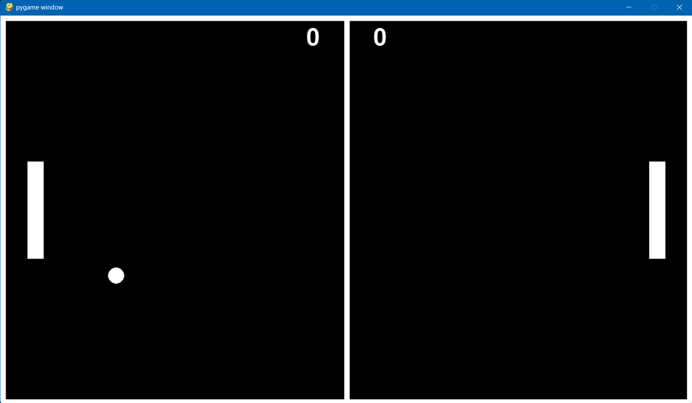

# Pygame Pong

A classic two‑player **Pong** remake built with Pygame. Move your paddle, bounce the ball, and out‑score your opponent to **5** points to win.

---

## Table of Contents

* [Description](#description)
* [Screenshot](#screenshot)
* [Requirements](#requirements)
* [Installation](#installation)
* [Usage](#usage)
* [Project Structure](#project-structure)
* [Code](#code)

  * [app.py](#apppy)
  * [Makefile](#makefile)
  * [requirements.txt](#requirementstxt)
* [Contributing](#contributing)
* [License](#license)
* [Notes](#notes)

---

## Description

This Pong clone opens a **1280 × 720** window framed by a white border. Each player controls a paddle:

| Player       | Keys                                      |
| ------------ | ----------------------------------------- |
| **Player 1** | <kbd>W</kbd> (up)  /  <kbd>S</kbd> (down) |
| **Player 2** | <kbd>↑</kbd> (up)  /  <kbd>↓</kbd> (down) |

The first player to reach **5 points** wins. Collisions add a bit of random vertical speed; the ball gradually slows if it exceeds the maximum speed, flashing red as a warning.

---

## Screenshot

Below is an example of the running game window (replace *ss.png* with your own capture):



---

## Requirements

* **Python ≥ 3.6**
* **Pygame** (declared in `requirements.txt`)
* **Windows** for the provided Makefile (see *Notes* for Unix)
* **Make** (`mingw32-make` or similar)

---

## Installation

### 1 – Clone the project

```bash
git clone https://github.com/your‑name/PygamePong.git
cd PygamePong
```

### 2 – Create the virtual environment & install dependencies

```bash
make install
```

This creates `venv/` and installs Pygame.

### 3 – PowerShell execution policy (Windows only)

If you see *“running scripts is disabled”*:

```powershell
Set-ExecutionPolicy -Scope CurrentUser -ExecutionPolicy RemoteSigned
```

Respond **Y** when prompted.

---

## Usage

### Run the game

```bash
make run
```

The Makefile activates the virtual environment and launches `app.py`.

### Controls & Rules

* **Player 1** → <kbd>W</kbd>/<kbd>S</kbd>.
* **Player 2** → <kbd>↑</kbd>/<kbd>↓</kbd>.
* Reach **5 points** to end the match.
* Close the window to quit.

### Clean up

```bash
make clean
```

Removes `venv/` and Python cache files.

---

## Project Structure

```text
PygamePong/
├── app.py              # Core game logic
├── Makefile            # Setup & run helpers (Windows)
├── requirements.txt    # Python dependencies
├── ss.png              # Screenshot used in README
└── README.md           # This document
```

---

## Code

### app.py

```python
import pygame
import time
import random

width = 1280
height = 720
size = (width, height)
screen = pygame.display.set_mode(size)
clock = pygame.time.Clock()
pygame.init()
fps = 60
done = False
mode = "game"
score = [0, 0]
maxscore = 5
p1w = 30; p1h = 180; p1x = 50; p1y = height/2 - p1h/2; p1v = 0
p2w = 30; p2h = 180; p2x = width-50-p2w; p2y = (height/2) - (p2h/2); p2v = 0
pspeed = 1
ballx = width/2; bally = height/2; ballSize = 15; ballxv = 0; ballyv = 0
ballDirRight = True; ballSpeed = 8; ballMaxSpeed = 10
font = pygame.font.SysFont("gillsanusltracondensed", 65)
BLACK = (0, 0, 0); WHITE = (255, 255, 255); RED = (209, 41, 41)

# -------------- Drawing --------------

def drawGame():
    # border
    pygame.draw.rect(screen, WHITE, [0, 0, width, height], 10)
    # divider
    pygame.draw.line(screen, WHITE, [width/2, 0], [width/2, height], 10)
    # player 1 paddle
    pygame.draw.rect(screen, WHITE, [p1x, p1y, p1w, p1h])
    # player 2 paddle
    pygame.draw.rect(screen, WHITE, [p2x, p2y, p2w, p2h])
    # score
    left = font.render(str(score[0]), True, WHITE)
    right = font.render(str(score[1]), True, WHITE)
    screen.blit(left,  (width/2 - (left.get_rect().width + 50), 20))
    screen.blit(right, ((width/2) + 50, 20))

# -------------- Player update --------------

def tickPlayers(p1y, p2y, p1v, p2v):
    key = pygame.key.get_pressed()
    if key[pygame.K_w]:
        p1v -= pspeed
    elif key[pygame.K_s]:
        p1v += pspeed

    if key[pygame.K_UP]:
        p2v -= pspeed
    elif key[pygame.K_DOWN]:
        p2v += pspeed

    # friction
    p1v *= 0.9
    p2v *= 0.9

    # move paddles
    p1y += p1v
    p2y += p2v

    # constrain paddles
    if p1y < 0 or p1y + p1h > height:
        p1y -= p1v; p1v = 0
    if p2y < 0 or p2y + p2h > height:
        p2y -= p2v; p2v = 0

    return p1y, p2y, p1v, p2v

# -------------- Ball update --------------

def tickBall(ballx, bally, ballxv, ballyv):
    ballx += ballxv
    bally += ballyv

    player1 = [p1x, p1y, p1w, p1h]
    player2 = [p2x, p2y, p2w, p2h]

    if ball.colliderect(player1) or ball.colliderect(player2):
        if ball.colliderect(player1):
            ballx -= ballxv - 10
        else:
            ballx -= ballxv + 10
        ballxv *= -1
        ballyv += random.choice([1, 2])

    # bounce off top/bottom
    if bally <= ballSize:
        bally = ballSize + 1; ballyv *= -1
    if bally >= height - ballSize:
        bally = height - ballSize - 1; ballyv *= -1

    # soft cap speed
    if abs(ballxv) > ballMaxSpeed or abs(ballyv) > ballMaxSpeed:
        ballxv *= 0.9; ballyv *= 0.9
        pygame.draw.circle(screen, RED, (ballx, bally), ballSize)

    return ballx, bally, ballxv, ballyv

# -------------- Reset helpers --------------

def resetBall():
    return (width/2, height/2,
            ballSpeed if ballDirRight else -ballSpeed, 0,
            not ballDirRight,
            height/2 - p1h/2, height/2 - p2h/2)

def checkScore():
    if ballx - ballSize > width:  return 0  # player 1 scores
    if ballx + ballSize < 0:      return 1  # player 2 scores
    return -1

ballx, bally, ballxv, ballyv, ballDirRight, p1y, p2y = resetBall()

# -------------- Game loop --------------
while not done:
    screen.fill(BLACK)
    for event in pygame.event.get():
        if event.type == pygame.QUIT:
            done = True

    if mode == "game":
        if checkScore() != -1:
            mode = "scored"
            score[checkScore()] += 1
            timer = 0
            ballx, bally, ballxv, ballyv, ballDirRight, p1y, p2y = resetBall()

        drawGame()
        ball = pygame.draw.circle(screen, WHITE, (ballx, bally), ballSize)
        p1y, p2y, p1v, p2v = tickPlayers(p1y, p2y, p1v, p2v)
        ballx, bally, ballxv, ballyv = tickBall(ballx, bally, ballxv, ballyv)
        pygame.display.update()

    if mode == "scored":
        timer += 1
        if timer >= 1.5 * fps:
            mode = "game"
        if score[0] >= maxscore or score[1] >= maxscore:
            mode = "game over"

    if mode == "game over":
        winner = "player 1" if score[0] > score[1] else "player 2"
        end = font.render(
            f"Congrats {winner}! You won by {abs(score[0] - score[1])} points.",
            True, WHITE)
        screen.blit(end, (width/2 - end.get_rect().width/2,
                           height/2 - end.get_rect().height/2))
        pygame.display.update()

    clock.tick(fps)
```

### Makefile

```makefile
# Variables
PYTHON = python
PIP = pip
VENV = venv
MAIN_SCRIPT = app.py

.PHONY: all install run clean

all: install run

install:
	$(PYTHON) -m venv $(VENV)
	$(VENV)\Scripts\pip install --upgrade pip
	$(VENV)\Scripts\pip install -r requirements.txt

install-lib:
	$(VENV)\Scripts\pip install -r requirements.txt

run:
	powershell -Command "& { . $(VENV)\Scripts\Activate.ps1; python $(MAIN_SCRIPT) }"

clean:
	if exist $(VENV) rmdir /s /q $(VENV)
	if exist __pycache__ rmdir /s /q __pycache__
	del /s /q *.py

```
